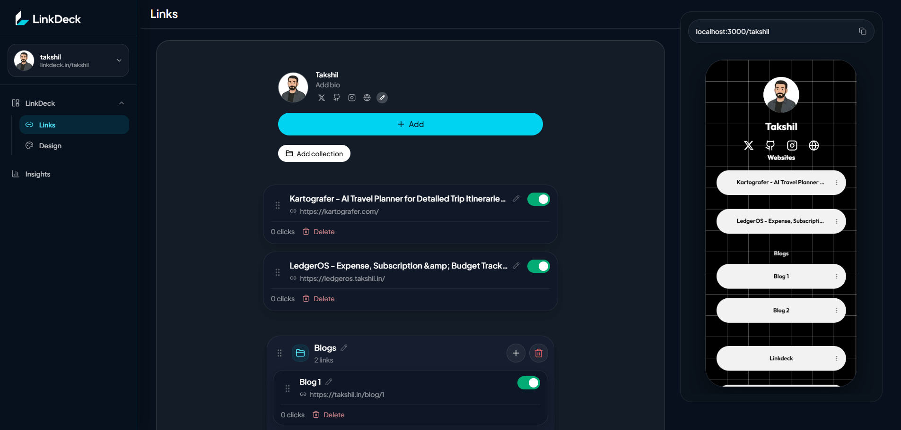
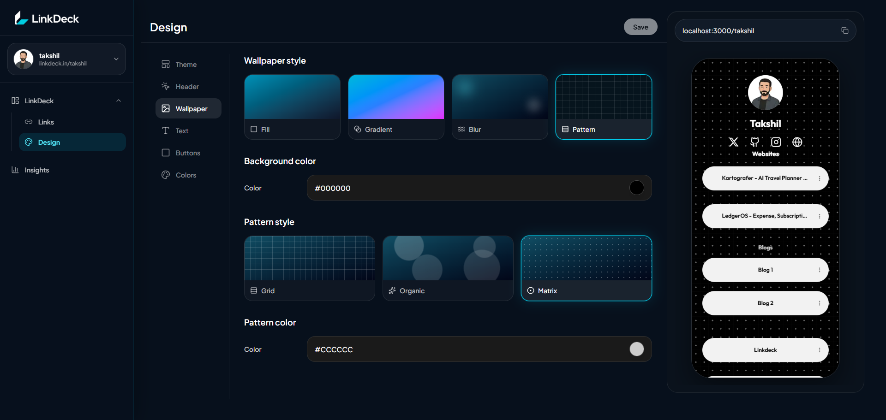
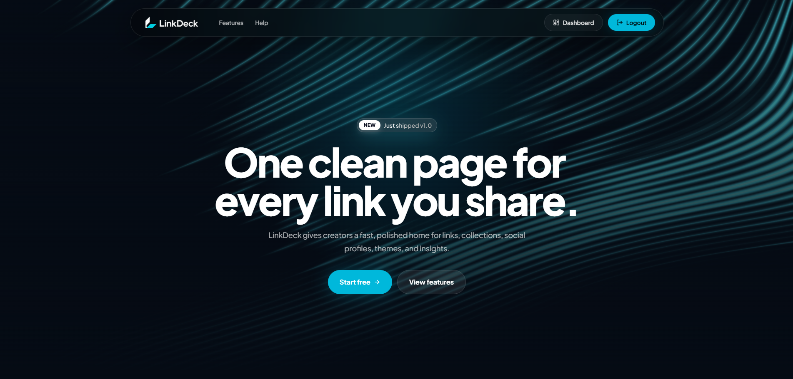
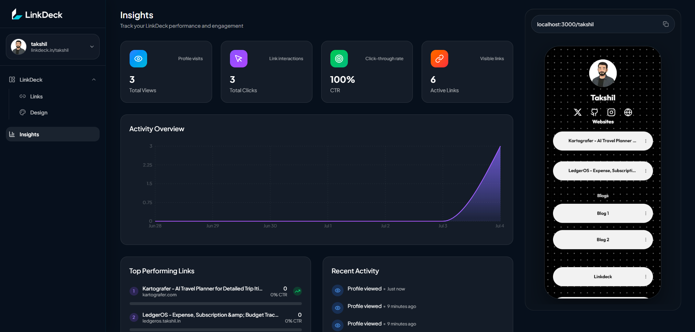

<p align="center">
  
</p>

<div align="center">

<h1 align="center">LinkDeck.in</h1>

A modern Linktree-style SaaS for creators, developers, freelancers, and brands to manage, customize, analyze, and share all their links from one polished public profile.

<br/>


</div>

---

## ✨ About

**LinkDeck.in** is a full-stack Linktree-style SaaS that helps users create one clean public profile for their most important links, social platforms, projects, content, resources, and collections.

The V1 product includes authentication, onboarding, a dashboard for managing links and collections, public profile rendering, theme customization, social icons, live preview, account settings, help content, and basic analytics for profile views and link clicks.

LinkDeck is built for creators, developers, freelancers, and brands who want a polished shareable page without building a full website from scratch.

---

## 🚀 Core Features

- **Public profile pages** at `/username`
- **Authentication** with email credentials, Google OAuth, and GitHub OAuth
- **Guided onboarding** for username, theme, platforms, links, and profile details
- **Link management** with add, edit, delete, visibility toggle, URL normalization, and ordering
- **Collections** for grouping related links and resources
- **Profile customization** for avatar, display name, username, and bio
- **Theme customization** for background, typography, buttons, icon color, and layout styling
- **Real-time dashboard preview** with a phone-style public page renderer
- **Insights dashboard** for profile views, link clicks, CTR, top links, charts, and recent activity

---

## 📸 Screenshots

| Links | Design |
|---|---|
|  |  |

| Landing page | Insights |
|---|---|
|  |  |

---
## 🎨 Theme & Preview System

LinkDeck V1 includes a complete theme and preview workflow for customizing public profiles without code.

Theme and preview features include:

- **Default themes** stored in the database
- **User customizations** for theme overrides
- **Background styles** including fill, gradient, blur, and pattern modes
- **Button styling** for solid, glass, and outline styles
- **Button radius and shadow controls**
- **Text styling** for title, profile text, bio, and fonts
- **Icon color customization** for social icons
- **Real-time dashboard preview** using Zustand preview state
- **Public rendering** through the shared theme profile renderer

The same theme data that powers the dashboard preview is used to render the final public `/username` page.

---

## 📊 Analytics System

LinkDeck V1 includes a lightweight event-based analytics system for public profiles and links.

Analytics features include:

- **Profile views** recorded when visitors open a public profile
- **Link clicks** tracked through redirect and click endpoints
- **CTR calculation** based on profile views and total clicks
- **Top-performing links** ranked by engagement
- **Recent activity** for profile and link events
- **Activity charts** powered by dashboard analytics data
- **Event-based storage** using the `AnalyticsEvent` Prisma model

The analytics system is intentionally focused on useful creator insights: what visitors viewed, what they clicked, and which links are performing best.

---

## 🧱 Architecture

LinkDeck.in is built as a full-stack **Next.js App Router monolith**.

Architecture highlights:

- **App Router monolith** for landing pages, auth pages, onboarding, dashboard, help center, account settings, and public profiles
- **Server Actions** for protected dashboard mutations such as links, collections, profile updates, social icons, theme saves, account actions, and onboarding
- **API Routes** for auth-related flows, OTP verification, username completion, image uploads, redirect tracking, and click tracking
- **Prisma ORM v7 + PostgreSQL** for persistence, schema modeling, relational data, and analytics events
- **Redis Cloud in production and Docker Redis locally** through `REDIS_URL` / `ioredis` for OTP, bootstrap sessions, cooldowns, and rate limits
- **NextAuth / Auth.js** for credentials login, Google OAuth, GitHub OAuth, JWT sessions, and protected route access
- **Zustand** for dashboard design-preview state
- **Cloudinary** for profile image upload storage
- **Vercel-ready build flow** with Prisma client generation before Next.js compilation

---

## 🛠 Tech Stack

### Frontend

- **Next.js App Router** — routing, layouts, server components, and full-stack React architecture
- **TypeScript** — type-safe application development
- **Tailwind CSS** — utility-first styling and responsive UI
- **Zustand** — lightweight client state management for dashboard preview/customization flows
- **dnd-kit** — drag-and-drop link and collection ordering
- **Sonner** — toast notifications
- **Recharts** — insights and analytics visualizations

### Backend

- **Next.js Server Actions** — protected dashboard mutations and account actions
- **Next.js API Routes** — auth-related endpoints, uploads, redirects, and analytics tracking
- **NextAuth / Auth.js** — authentication, sessions, OAuth, and credentials login

### Database

- **PostgreSQL** — primary relational database
- **Prisma ORM v7** — schema modeling, migrations, and type-safe database access

### Caching / Infra

- **Redis** — OTP, cooldown, rate-limit, and cache-oriented flows
- **ioredis** — Redis client for local Docker Redis and Redis Cloud
- **Docker** — local development services

---

## 🗂 Project Structure

```txt
app/
  (site)/                 Landing, auth, and post-auth routes
  (main)/                 Dashboard, onboarding, and account routes
  [username]/             Public profile pages
  api/                    Auth, upload, redirect, and analytics endpoints

actions/
  account/                Password and security server actions
  analytics/              Profile-view tracking actions
  dashboard/              Links, profile, social icon, and design actions
  onboarding/             V1 onboarding actions

components/
  account/                Account settings UI
  dashboard/              Dashboard, insights, design, and link board UI
  help/                   Help center UI
  landing/                Landing page sections and animations
  theme/                  Public profile renderer and theme parts
  ui/                     Shared UI primitives

lib/
  security/               OTP and rate-limit helpers
  server/                 Server-only analytics and URL-title helpers
  themes/                 Theme constants and merge utilities
  validators/             Zod validation schemas

prisma/
  schema.prisma           PostgreSQL schema and Prisma models
```

---

## ⚙️ Local Setup

### 1. Clone the repository

```bash
git clone https://github.com/TakshilCodes/linkdeck
cd linkdeck
```

### 2. Install dependencies

```bash
npm install
```

### 3. Setup environment variables

Create a `.env` file from `.env.example` and fill in the required values.

```bash
cp .env.example .env
```

On Windows:

```bash
copy .env.example .env
```

Redis configuration:

```env
# Local Docker Redis
REDIS_URL=redis://localhost:6379

# Redis Cloud / production
REDIS_URL=redis://default:<password>@<host>:<port>
# Use rediss:// if TLS is enabled for your Redis Cloud database.
```

### 4. Start Docker services if applicable

If you are using local Docker services for PostgreSQL and Redis:

```bash
docker compose up -d
```

### 5. Run Prisma migrations

```bash
npx prisma migrate dev
```

### 6. Generate Prisma client

```bash
npx prisma generate
```

### 7. Start the development server

```bash
npm run dev
```

Open the app locally at:

```txt
http://localhost:3000
```

---

## 🧪 Useful Commands

```bash
npm run dev
```

```bash
npm run lint
```

```bash
npm run build
```

```bash
npx prisma generate
```

```bash
npx prisma migrate dev
```

---

## ✅ Project Status

> ✅ LinkDeck.in V1 Completed

LinkDeck.in V1 includes the complete core product experience: landing page, authentication, onboarding, dashboard link management, collections, public profiles, theme customization, live preview, analytics, account settings, uploads, and help center.

---

<div align="center">

Built for creators who want one clean place to share everything.

**LinkDeck.in**

</div>
